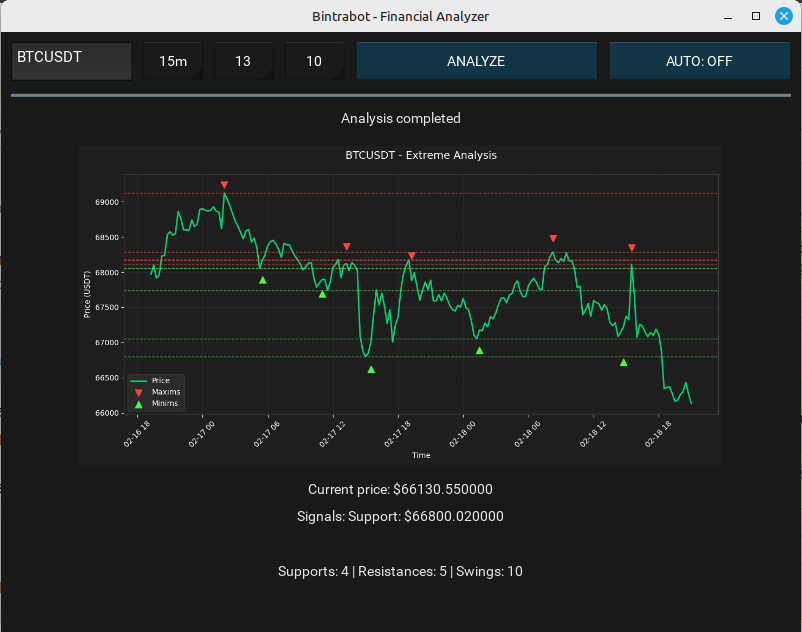

# Bintrabot - A free, fast and open-source financial analysis bot for cripto trading

[](https://bintrabot.jonlem.com)

Welcome to bintrabot, a trading tool that can analyse extremely fast the price of a list of assets, it is designed to assist traders and programmers in the automated identification of market structures. Using the public API of the most popular exchanges such as Binance, Bybit, Kucoin, Kraken, OKX, and more, this software analyzes price action in real time to detect pivot points (swings), dynamic support, and resistance levels. it's capabilities consists on:

- Connect to different exchanges.
- Watch prices.
- Send price alerts in real-time via telegram.
- Create custom graphics.
- Calculate supports and resistances in multiple timeframes to find possible matches between them.
- Detect multiple swings.
- Filter specific assets for custom analysis.

Bintrabot can works as a desktop app pimarily, but it can runs in background as a system service with no ui if you want to deploy it to a server (like a VPS or dedicated server), also (and optionally but recommended) can launch a web server to access it via URL, this feature requires [Bintrabot web ui](https://bintrabot.jonlem.com/docs/web-ui) to be installed.

## Disclaimer

This software is for fast technical analysis purposes only. Bintrabot developers are NOT responsible for the decisions you make or the results you get from such analysis. Use this software at your own discretion and to save time.

## Features

- Real-time monitoring
- Graphics

## Quick start

A simple quick start example.

## Basic CLI usage

```sh
$> bintrabot -h

Welcome to bintrabot, A free and fast financial analyser bot for cripto trading.

More info: https://bintrabot.jonlem.com

Usage:
  Bintrabot <command [--options]>
  Bintrabot [--options]

Commands:
  run                                           Runs the bot.
  config                                        Creates and manages configuration files.

Options:
  -h, --help                                    Shows this help message.
  -v, --version                                 Prints the current software version.

  For specific command help type `Bintrabot <command> --help`
```

## Requirements

For an optimal performance and avoid runtime errors, it's recommended to have an environment with the following requirements.

### Software 

- Python >= 3.11

### Hardware

- CPU: 4 Cores (or higher) with minimum 2.33GHz of processing
- RAM: Minimum of 4GB of RAM (Recommended 8GB)
- Storage: Minimum of 62GB of free storage.

## Deployment

[Deployment documentation]

## Documentation

You can see detailed documentation at the [Official Website](https://bintrabot.jonlem.com)
